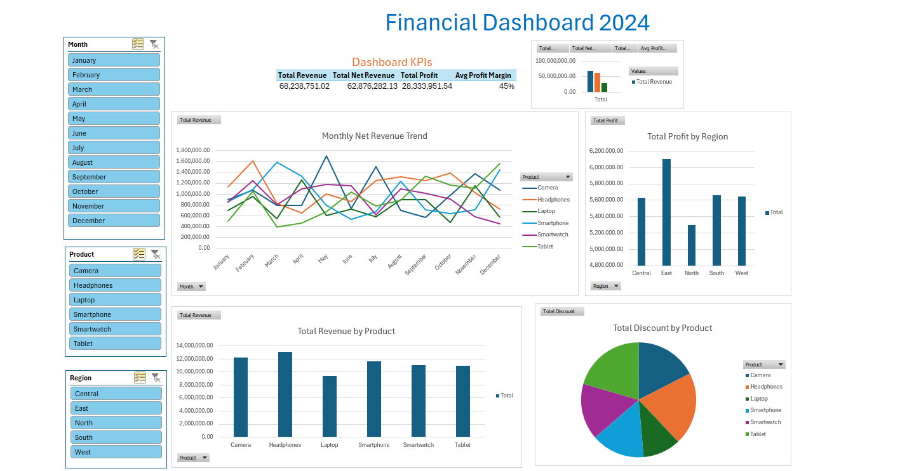

# Excel Financial Analysis Project 📊

This project showcases advanced Excel skills applied to a structured financial dataset. It includes data analysis, custom calculations, and interactive dashboards.

## 🔍 Project Overview

- **Dataset**: Financial data for 5 regions and 6 products over a 12-month period
- **Key Activities**:
  - Data formatting
  - Summary statistics using built-in functions
  - Profit margin and other custom metrics
  - Conditional formatting
  - PivotTables for dynamic analysis
  - Visualizations: bar, pie, and line charts
  - Interactive dashboard with slicers
 
  - 
  > 🔍 A snapshot of the interactive dashboard with slicers and dynamic charts

## 📁 File Included

- `Financial_Dataset.xlsx` – Fully structured Excel workbook with labeled sheets and interactive elements

## 💡 Skills Demonstrated

- ✅ Advanced formula use 
- ✅ Data organization and professional formatting
- ✅ Insight extraction using PivotTables
- ✅ Dynamic dashboards with visual storytelling
- ✅ Business logic and real-world application

## 🧠 Use Case

This project is intended to demonstrate:
- Strong proficiency in Excel for business and data tasks
- Ability to organize and present insights clearly
- Practical application of data analysis techniques
- Dashboard and reporting skills for decision-making

---

> Feel free to download and explore the file. This project reflects a professional approach to Excel-based problem solving and reporting.
